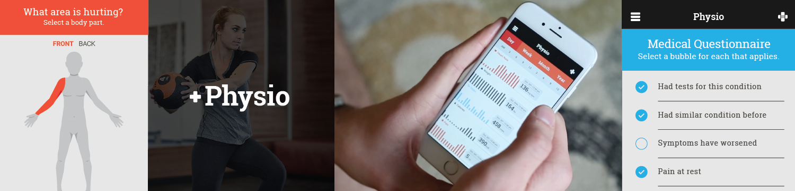

# IBM Ready App for Healthcare

### Overview

IBM Ready App for Healthcare is the first of the IBM Ready App Series. 

This app 
* improves patient recovery timeframes 
* increases patient adherence to at-home physical therapy programs 
* tracks patient progress regardless of wearable utilized
* gives patients access to a customized, at-home exercise library that can be accessed anywhere
* enables patients to track and manage pain levels throughout the recovery process

With this app, patients can also fill out medical questionnaires and progress reports from any place with their mobile device prior to their in-clinic appointments.

### Getting started
Please visit the [Getting Started page](http://lexdcy040194.ecloud.edst.ibm.com/physio_1_0_2/getting_started) to set up the project.

### Documentation
Please visit [this page](http://lexdcy040194.ecloud.edst.ibm.com/physio_1_0_2/home) for access to the full documentation.

### License
IBM Ready App for Healthcare is available under the IBM Ready Apps License Agreement. See the [License file](https://github.com/IBM-MIL/IBM-Ready-App-for-Healthcare/blob/master/License.txt) for more details.
